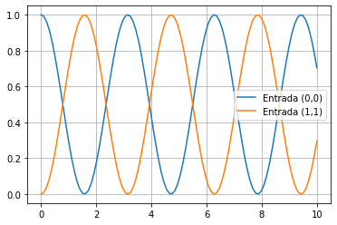

# Tutorial de ejemplo

En este tutorial, mostramos cómo utilizar el método **RK4** para graficar el comportamiento de la función que representa un sistema dinámico. En este caso, queremos estudiar la evolución temporal de un estado $\mathbf{y}(t)$. Este estado será representado mediante una matriz 2x2 que corresponde a algún operador lineal.
La función que genera la dinámica del problema es:

$$
f(t, \mathbf{y}) = -{\rm{i}} [\mathbf{O}, \mathbf{y}(t)],
$$

Donde $\mathbf{O}$ es otro operador lineal, ${\rm{i}}$ es la constante compleja y $[A, B] = AB - BA$ es un operación de conmutación. Note que **la función $f(t, \mathbf{y})$ no depende explícitamente de la variable temporal**.

### Paso 1: Importar las bibliotecas necesarias

```python
import numpy as np
import matplotlib.pyplot as plt
from methodRK4 import dyn_generator, rk4
```

### Paso 2: Definición de las variables iniciales

```python
# Operador lineal
oOper = np.array([[0, 1], [1, 0]])

# Estado inicial
yInit = np.array([[1, 0], [0, 0]])

# Arreglo de valores temporales
times = np.linspace(0,10,100)

# Valor del paso temporal
h = times[1] - times[0]

# Arreglos con los resultados en las posiciones (0,0) y (1,1) de la matriz resultante
stateQuant00 = np.zeros(times.size)
stateQuant11 = np.zeros(times.size)
```

### Paso 3: Ejecutar función RK4 a través del tiempo

```python
for tt in range(times.size):
    # Guarde el valor de las entradas (0,0) y (1,1) en los arreglos que definimos
    # Obtenga estos valores de las entradas de yInit
    stateQuant00[tt] = yInit[0][0].real
    stateQuant11[tt] = yInit[1][1].real
    
    # Invoque rk4 operando sobre yInit
    # y devuelva el resultado a un nuevo yN
    yN = rk4(dyn_generator,oOper,yInit,h)
    
    # Ahora asignamos yN a yInit
    # De esta manera, en la siguiente iteración, el operador de esta iteración se convierte en el inicial
    # de la siguiente iteración
    yInit = yN
```

### Paso 4: Graficar los resultados

```python
#Grafica la entrada (0,0) en funcion de times
plt.plot(times, stateQuant00, label='Entrada (0,0)') 
 
#Grafica la entrada (1,1) en funcion de times
plt.plot(times, stateQuant11, label='Entrada (1,1)') 

#Muestra la cuadricula y la leyenda
plt.grid(True)
plt.legend()
```

Grafica resultante esperada:


